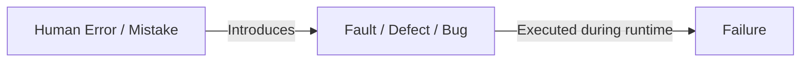
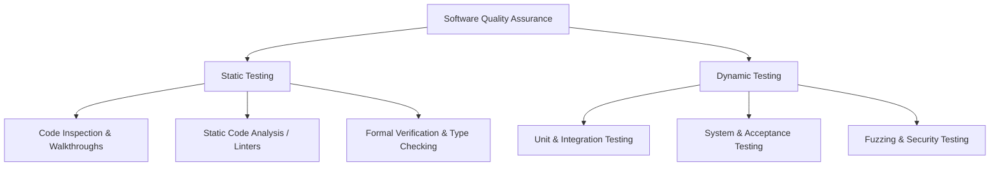
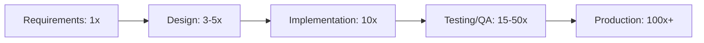

# Software Testing Foundations

Software testing is an empirical investigation conducted to provide stakeholders with information about the quality of the software product or service under test.

> [!quote] Edsger W. Dijkstra
> *"Program testing can be used to show the presence of bugs, but never to show their absence!"*

---

## 1. Core Terminology: The Hierarchy of Defects

Understanding the precise difference between mistakes, defects, and runtime failures is fundamental to software quality engineering.

### Definitions

> [!definition] Error / Mistake
> A human action (by a developer, designer, or analyst) that produces an incorrect result (e.g., a misunderstanding of requirements or a typo in code).

> [!definition] Fault / Defect / Bug
> An anomalous condition or flaw in the source code / system artifacts resulting from an error. A fault is static and resides in the codebase.

> [!definition] Failure
> An event in which the system fails to deliver its expected service or deviates from its specified behavior during execution. A failure is dynamic and requires runtime activation.

> [!important] Key Takeaway
> - Not all **faults** result in **failures** (a fault in dead code or an unreached branch will never produce a failure).
> - Every software **failure** is caused by one or more **faults** being executed under specific state conditions.

---

## 2. Verification vs. Validation (V&V)

Quality assurance balances two complementary perspectives:

| Dimension | Verification | Validation |
| :--- | :--- | :--- |
| **Core Question** | *"Are we building the product right?"* | *"Are we building the right product?"* |
| **Focus** | Conformance to specifications, architecture, and standards | Meeting user requirements, real-world needs, and business goals |
| **Activities** | Code reviews, static analysis, unit tests, formal verification | User acceptance testing (UAT), field testing, usability experiments |

---

## 3. Static vs. Dynamic Testing

Software evaluation approaches fall into two execution categories:

- **Static Testing**: Evaluates code and artifacts **without executing** the program (e.g., syntax checking, style analysis, data-flow anomaly detection, code reviews).
- **Dynamic Testing**: Evaluates the software by **executing** code with specific test inputs and observing runtime behavior.

---

## 4. Testing vs. Debugging

Testing and debugging are distinct phases of the development lifecycle:

- **Testing**: The process of *finding* failures and uncovering unknown faults.
- **Debugging**: The process of *locating, diagnosing, and fixing* the underlying fault once a failure has been observed.

---

## 5. Economics & The Cost of Bugs

The cost to detect and fix software defects increases exponentially as software moves through the development lifecycle:

$$ \text{Cost to Fix} \propto e^{\text{Lifecycle Stage}} $$

> [!tip] Shift-Left Philosophy
> Early detection of faults during requirements, architecture, and unit testing dramatically reduces total project cost and prevents catastrophic production outages.

---

## Related Notes
- [[Testing Strategies & Test Harnesses]] — Levels of testing, black/white/grey box, and test oracles
- [[Unit Testing & xUnit Frameworks]] — Structured unit testing architectures
- [[Code Coverage Criteria]] — Measuring how thoroughly dynamic tests exercise the codebase

---

## Lecture Sources & History
- **Lecture 1** (`Lecture 1 - Introduction to Testing.pdf`) — Software testing terminology, V&V, static vs dynamic testing, Dijkstra's principle.
