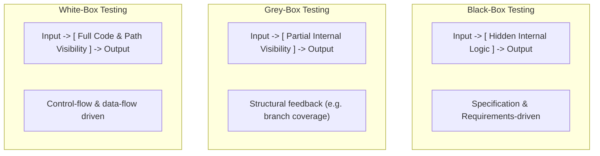
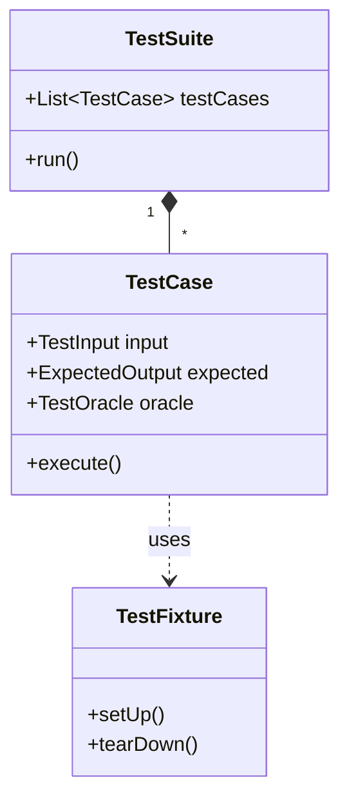
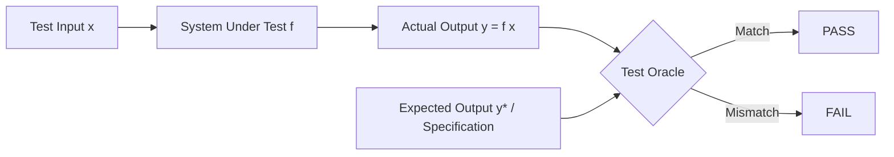

# Testing Strategies & Test Harnesses

Software testing strategies determine how tests are conceived, structured, executed, and evaluated relative to the system's internal implementation details.

---

## 1. Box Testing Strategies (Visibility-Based)

Testing techniques are categorized by the level of visibility the tester or automated test tool has into the internal source code:

### Comparative Summary

| Strategy | Visibility | Key Techniques | Primary Advantages | Limitations |
| :--- | :--- | :--- | :--- | :--- |
| **Black-Box** | Zero internal code knowledge | [[Input Space Partitioning & Combinatorial Testing#Equivalence Partitioning\|Equivalence Partitioning]], [[Input Space Partitioning & Combinatorial Testing#Boundary Value Analysis (BVA)\|Boundary Value Analysis]] | Unbiased; tests user requirements directly; code-agnostic | Cannot identify dead code or hidden logic paths |
| **White-Box** | Full internal source code visibility | [[Control Flow Graphs (CFG)|CFG Analysis]], [[Code Coverage Criteria|Code Coverage]], [[Modified Condition Decision Coverage (MCDC)|MC/DC]] | Thoroughly exercises implementation logic and hidden edge cases | Labor intensive; does not reveal missing specification features |
| **Grey-Box** | Partial visibility (e.g., architecture, byte instrumentation) | [[Fuzzing#2. Grey-Box Fuzzing\|Coverage-guided Fuzzing]], State-machine testing | Combines speed of black-box with guidance of white-box | Requires lightweight instrumentation |

---

## 2. Test Cases, Test Suites, and Test Fixtures

Modern automated testing relies on modular abstractions to manage test inputs and execution state.

### Components

> [!definition] Test Case
> A set of test inputs, execution preconditions, and expected outcomes developed for a particular objective (such as exercising a specific program path or verifying compliance with a requirement).
> 
> Formally, a test case consists of:
> $$ \text{TestCase} = \langle \text{Input Data } (x), \text{Preconditions } (P), \text{Expected Output } (y), \text{Postconditions } (Q) \rangle $$

> [!definition] Test Suite
> A collection of test cases grouped together for execution purposes (e.g., Smoke Test Suite, Regression Test Suite, Integration Test Suite).

> [!definition] Test Harness & Runner
> A software framework that configures the execution environment, executes test suites, records test outcomes, and reports passes/failures.

> [!definition] Test Fixture
> The fixed baseline state required to run a test repeatedly and deterministically. Managed via setup (`setUp()`) and teardown (`tearDown()`) routines.

---

## 3. The Test Oracle

A **Test Oracle** is the mechanism used to determine whether the software passed or failed a given test execution.

$$ \text{Oracle}(x, \text{actual\_output}) \to \{\text{PASS}, \text{FAIL}\} $$

### Types of Oracles
1. **Direct Value Assertions**: Exact match against pre-calculated values (e.g., `assertEqual(4, square(2))`).
2. **Implicit / Crash Oracles**: Checking that the program runs without crashing, memory leaks, or unhandled exceptions (standard in [[Fuzzing]]).
3. **Property / Contract Oracles**: Invariants that must hold across all outputs (e.g., $y \ge 0$, sorted output is monotonic).
4. **Relational Oracles**: Comparing relative output shifts between transformed inputs (see [[Metamorphic Testing]]).

> [!warning] The Oracle Problem
> In many complex domains (machine learning, scientific computing, graphics rendering, search algorithms), calculating the expected output manually is impossible or computationally infeasible. This is known as the **Oracle Problem**.

---

## Related Notes
- [[Software Testing Foundations]] — Error, fault, failure definitions and testing economics
- [[Unit Testing & xUnit Frameworks]] — Concrete implementation of test runners and suites
- [[Metamorphic Testing]] — Advanced solution to the Oracle Problem

---

## Lecture Sources & History
- **Lecture 2** (`Lecture 2 - Basic Testing Concepts.pdf`) — Black-box, white-box, grey-box testing, test cases, test suites, test runners, and test oracles.
