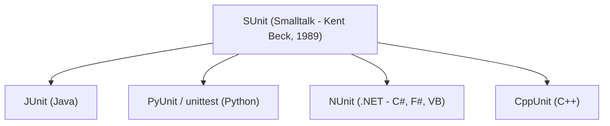
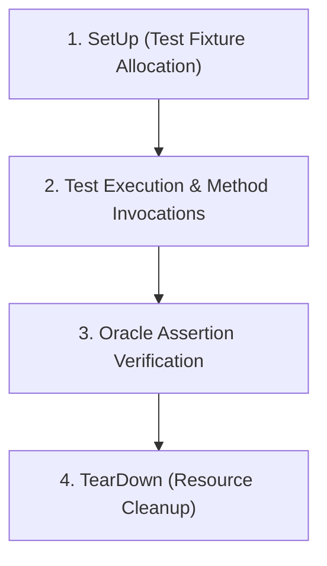

# Unit Testing & xUnit Frameworks

Unit testing verifies individual software units (functions, methods, classes) in isolation to ensure that internal logic functions strictly according to design.

---

## 1. The xUnit Family Architecture

The **xUnit** pattern represents the industry-standard architecture for programmatic unit testing frameworks.



### Historical Context
- **SUnit**: Originally designed by **Kent Beck** in 1989 for Smalltalk. It established the core design patterns of test fixtures, assertions, and test runners.
- **JUnit**: Port of SUnit to Java (developed by Kent Beck and Erich Gamma).
- **PyUnit / unittest**: Python standard library port.
- **NUnit**: Port for .NET ecosystems.

---

## 2. Core Components of xUnit

An xUnit test framework consists of four primary structural components:



1. **Test Case Class**: Container grouping related test methods that share fixture setups.
2. **Assertions (`assert*`)**: The embedded [[Testing Strategies & Test Harnesses#3. The Test Oracle\|Test Oracle]] checking expected state versus actual return values:
   - `assertEqual(expected, actual)`
   - `assertTrue(condition)` / `assertFalse(condition)`
   - `assertNull(obj)` / `assertNotNull(obj)`
   - `assertThrows(ExpectedException.class, lambda)`
3. **Test Fixtures (`setUp` / `tearDown`)**:
   - `setUp()`: Executes *before each* test method to instantiate fresh objects and establish preconditions.
   - `tearDown()`: Executes *after each* test method to release connections, close file handles, and prevent cross-test state contamination.
4. **Test Runner**: Discovers test cases, executes them sequentially or concurrently, and presents summary metrics (passes, failures, errors, execution time).

---

## 3. Structure of an Ideal Unit Test: AAA Pattern

Unit tests should adhere to the **Arrange-Act-Assert (AAA)** structure:

```python
import unittest

class CalculatorTest(unittest.TestCase):
    def setUp(self):
        # Arrange (shared state)
        self.calc = Calculator()

    def test_addition(self):
        # Arrange
        a, b = 10, 5
        
        # Act
        result = self.calc.add(a, b)
        
        # Assert (Oracle)
        self.assertEqual(result, 15)

    def tearDown(self):
        # Clean up resources
        self.calc = None
```

---

## 4. Key Unit Testing Best Practices

> [!tip] First Principles of Unit Testing
> - **Fast**: Unit tests must execute in milliseconds so developers run them continuously.
> - **Isolated / Independent**: Tests must not depend on the order of execution or share mutable static state.
> - **Repeatable / Deterministic**: Running the test 1,000 times without code changes should produce the exact same outcome every time.
> - **Self-Validating**: Tests must evaluate their own pass/fail status without manual inspection of logs.
> - **Timely**: Written alongside code or beforehand (Test-Driven Development / TDD).

---

## Related Notes
- [[Software Testing Foundations]] — Why we test and basic defect terminology
- [[Testing Strategies & Test Harnesses]] — Test cases, suites, and oracles
- [[Control Flow Graphs (CFG)]] — Analyzing the internal structural paths that unit tests execute
- [[Code Coverage Criteria]] — Measuring how thoroughly unit tests cover the codebase

---

## Lecture Sources & History
- **Lecture 3** (`Lecture 3 - .pdf`) — xUnit genealogy (SUnit, JUnit, NUnit, PyUnit) and unit testing patterns.
