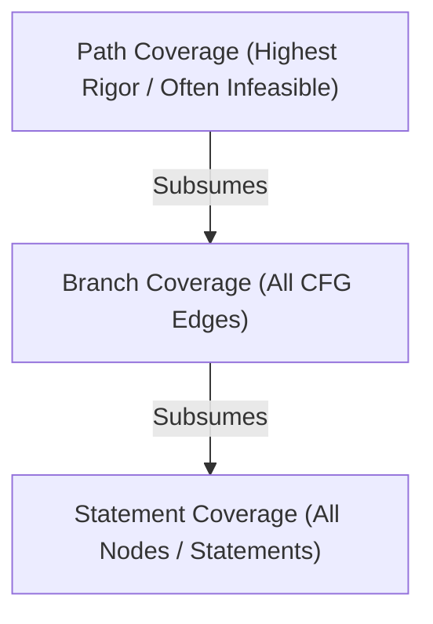
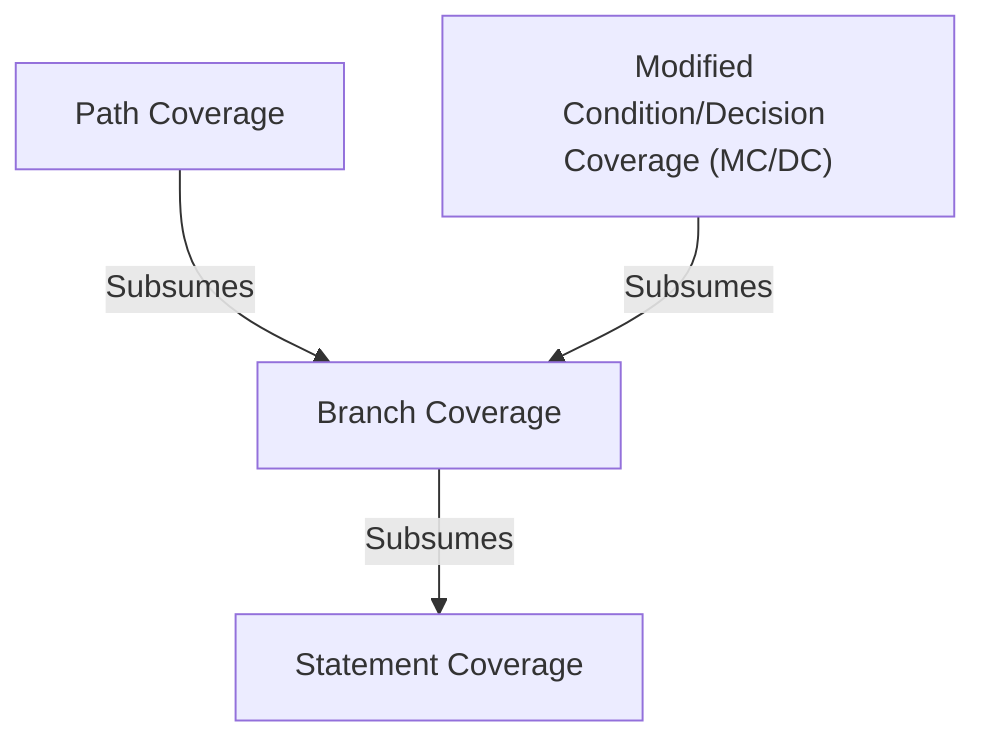

# Code Coverage Criteria

**Code Coverage Criteria** are test adequacy metrics that quantify the degree to which the source code of a program is executed when a particular test suite runs.

---

## 1. Primary Coverage Metrics



### 1.1. Statement Coverage (Node Coverage)
- **Goal**: Execute every executable statement (or CFG node) in the program at least once.
- **Formula**:
  $$ \text{Statement Coverage} = \frac{\text{Executed Statements}}{\text{Total Executable Statements}} \times 100\% $$
- **Limitation**: Can achieve 100% statement coverage without ever evaluating the `False` branch of an `if` statement that lacks an `else` block.

### 1.2. Branch Coverage (Edge Coverage / Decision Coverage)
- **Goal**: Execute every branch decision (every outgoing edge from a decision point in the [[Control Flow Graphs (CFG)|CFG]]) to both `True` and `False` outcomes.
- **Formula**:
  $$ \text{Branch Coverage} = \frac{\text{Traversed Branch Edges}}{\text{Total Branch Edges}} \times 100\% $$
- **Key Properties**:
  - For simple `if` statements: Must evaluate condition as both `True` and `False`.
  - For loops: Must execute loop body (True) and skip/exit loop (False).
  - For nested branches: Number of combinations grows exponentially ($2^k$).

### 1.3. Path Coverage
- **Goal**: Execute every possible distinct path from the entry node to the exit node in the program.
- **Formula**:
  $$ \text{Path Coverage} = \frac{\text{Executed Complete Paths}}{\text{Total Possible Complete Paths}} \times 100\% $$
- **Key Challenge (Path Explosion)**:
  - Any loop with dynamic bounds creates an **infinite** number of theoretical paths ($\infty$).
  - For $n$ consecutive independent sequential `if` statements, there are $2^n$ paths.
  - In practice, 100% path coverage is generally **infeasible**.

---

## 2. Subsumption Relationships Between Coverage Criteria

> [!definition] Subsumption
> A coverage criterion $A$ **subsumes** criterion $B$ ($A \implies B$) if and only if any test suite $T$ that satisfies criterion $A$ on a program $P$ is guaranteed to satisfy criterion $B$ on $P$.



### Proof: Branch Coverage Subsumes Statement Coverage

> [!theorem] Proof
> Consider any arbitrary statement $S$ in program $P$.
> 1. **Case 1**: $S$ is outside of any conditional branch (straight-line sequential code). In this case, entering the procedure always executes $S$.
> 2. **Case 2**: $S$ is inside a conditional branch controlled by decision $D$.
> 3. If a test suite achieves 100% Branch Coverage, every outgoing branch edge from $D$ (both `True` and `False`) is traversed.
> 4. Since the branch leading to $S$ is traversed, $S$ is guaranteed to execute.
> 
> $\therefore$ 100% Branch Coverage $\implies$ 100% Statement Coverage. $\blacksquare$

> [!warning] Reverse Does Not Hold
> 100% Statement Coverage **does not** imply 100% Branch Coverage.
> 
> *Example*:
> ```python
> if x < 0:
>     x = -x
> print(x)
> ```
> Test case $x = -5$ executes all 3 lines (100% statement coverage), but only exercises the `True` branch (50% branch coverage; `False` branch never executed).

---

## 3. Comparison of Criteria

| Criterion | Target in CFG | Strengths | Weaknesses |
| :--- | :--- | :--- | :--- |
| **Statement** | Vertices ($V$) | Easy to achieve, baseline metric | Misses logic paths, false sense of security |
| **Branch** | Edges ($E$) | Ensures all decision outcomes tested | Does not test combinations of conditions |
| **MC/DC** | Conditions within Decisions | High safety assurance, linear test size ($N+1$) | Complex to calculate manually |
| **Path** | All acyclic/cyclic paths | Comprehensive execution verification | Infeasible due to loop explosion ($\infty$) |

---

## Related Notes
- [[Control Flow Graphs (CFG)]] — Graph foundation for statement and branch coverage
- [[Modified Condition Decision Coverage (MCDC)]] — Rigorous criteria used in safety-critical avionics/automotive software
- [[Mutation Testing]] — Evaluating test quality beyond pure structural coverage

---

## Lecture Sources & History
- **Lecture 4** (`Lecture 4 - .pdf`) — Statement, branch, and path coverage definitions, and mathematical proof of branch subsuming statement coverage.
- **Lecture 7** (`Lecture 7.pdf`) — Practical coverage metrics on GCD algorithm.
