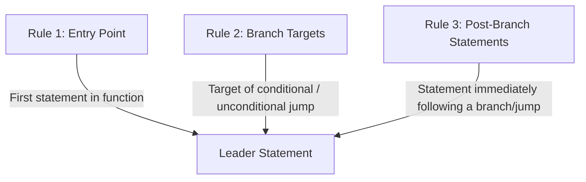
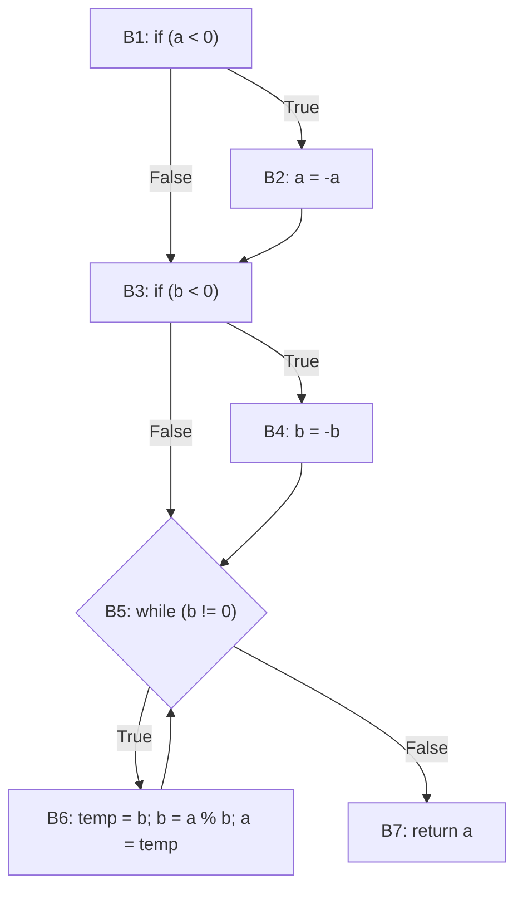

# Control Flow Graphs (CFG)

A **Control Flow Graph (CFG)** is a directed graph representation of all execution paths that may be traversed through a program during its execution. It forms the mathematical backbone of white-box testing and code coverage metrics.

---

## 1. Graph Elements

A CFG is defined as a directed graph $G = (V, E, s, e)$ where:
- **Vertices / Nodes ($V$)**: Represent **Basic Blocks** (maximal sequences of straight-line statements).
- **Edges ($E$)**: Represent the transfer of control between basic blocks (branches, jumps, loops, fall-throughs).
- **Entry Node ($s$)**: The entry point of the procedure.
- **Exit Node ($e$)**: The termination point of the procedure.

---

## 2. Basic Blocks & Leader Statements

> [!definition] Basic Block
> A **Basic Block** is a maximal sequence of consecutive program statements such that:
> 1. Control enters only at the **first statement**.
> 2. Control leaves only at the **last statement**.
> 3. If the first statement executes, all subsequent statements in the block execute in order without branching or halting.

### Rules for Identifying Leader Statements

To partition code into basic blocks, we first identify the **leader statements** (the first statement of every basic block):



1. **Rule 1**: The first statement of the function/program is a leader.
2. **Rule 2**: Any statement that is the **target of a branch or jump** (e.g., target of `if`, `while`, `goto`) is a leader.
3. **Rule 3**: Any statement that **immediately follows a branch or jump** statement is a leader.

> [!tip] Constructing Basic Blocks
> Once all leaders are identified:
> - Each basic block begins at a leader statement and extends up to (but does not include) the next leader statement or the end of the program.

---

## 3. Comprehensive Example: Greatest Common Divisor (GCD)

Consider the following Java implementation of Euclid's GCD algorithm:

```java
int gcd(int a, int b) {
    if (a < 0) {            // Line 1 (Branch)
        a = -a;             // Line 2 (Inside branch)
    }
    if (b < 0) {            // Line 3 (Branch)
        b = -b;             // Line 4 (Inside branch)
    }
    while (b != 0) {        // Line 5 (Loop condition / Branch)
        int temp = b;       // Line 6 (Loop body)
        b = a % b;          // Line 7
        a = temp;           // Line 8
    }
    return a;               // Line 9 (Return)
}
```

### Identification of Leaders & Basic Blocks

| Block | Statements | Leader Justification |
| :--- | :--- | :--- |
| **$B_1$** | `1: if (a < 0)` | **Rule 1**: Entry point of function |
| **$B_2$** | `2: a = -a;` | **Rule 2**: Target of branch `if (a < 0)` (True branch) |
| **$B_3$** | `3: if (b < 0)` | **Rule 3**: Statement immediately following branch `if (a < 0)` |
| **$B_4$** | `4: b = -b;` | **Rule 2**: Target of branch `if (b < 0)` (True branch) |
| **$B_5$** | `5: while (b != 0)` | **Rule 3**: Follows branch `if (b < 0)`; and **Rule 2**: Target of loop back-edge |
| **$B_6$** | `6: int temp = b; 7: b = a % b; 8: a = temp;` | **Rule 2**: Target of `while (b != 0)` (True branch) |
| **$B_7$** | `9: return a;` | **Rule 3**: Follows `while` condition (False branch / exit) |

### Control Flow Graph Visualization



---

## 4. Coverage Analysis on GCD CFG

Consider evaluating the test suite:
- $T_1$: `assertEqual(6, gcd(8, 48))`
- $T_2$: `assertEqual(1, gcd(2, 3))`
- $T_3$: `assertEqual(0, gcd(8, 0))`

### Execution Traces:
- **$T_1$ (`gcd(8, 48)`)**: $a \ge 0, b \ge 0$. Path: $B_1 \to B_3 \to B_5 \to B_6 \to B_5 \to B_6 \dots \to B_7$.
- **$T_2$ (`gcd(2, 3)`)**: $a \ge 0, b \ge 0$. Path: $B_1 \to B_3 \to B_5 \to B_6 \to B_5 \dots \to B_7$.
- **$T_3$ (`gcd(8, 0)`)**: $a \ge 0, b = 0$. Path: $B_1 \to B_3 \to B_5 \to B_7$.

### Coverage Metrics Evaluated:
- **Statement Coverage**: 7 / 9 statements executed (Blocks $B_2$ and $B_4$ are **never reached** because no negative inputs $a < 0$ or $b < 0$ were tested) $\implies \frac{7}{9} \approx 77.8\%$.
- **Block Coverage**: 5 / 7 basic blocks covered ($B_1, B_3, B_5, B_6, B_7$) $\implies \frac{5}{7} \approx 71.4\%$.
- **Branch Coverage**: 5 / 8 branch edges covered.
- **Path Coverage**: $\frac{\text{covered paths}}{\infty} = 0\%$ (Loops create an infinite set of potential paths).

---

## Related Notes
- [[Code Coverage Criteria]] — Formal definitions of statement, branch, and path coverage
- [[Modified Condition Decision Coverage (MCDC)]] — Advanced structural coverage criteria
- [[Search-Based Testing & Genetic Algorithms]] — Calculating branch distance on CFG edges to guide automated test generation

---

## Lecture Sources & History
- **Lecture 3** (`Lecture 3 - .pdf`) — Basic blocks and leader statement definitions.
- **Lecture 7** (`Lecture 7.pdf`) — CFG leader rules review, GCD step-by-step example, block/branch coverage evaluation.
