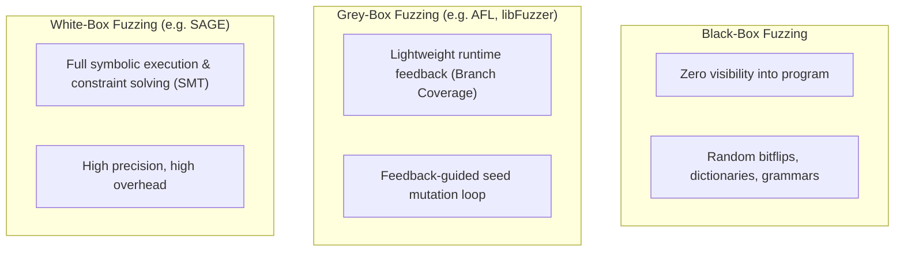

# Fuzzing & Coverage-Guided Fuzz Testing

**Fuzzing (Fuzz Testing)** is an automated software testing technique that feeds invalid, unexpected, malformed, or random data inputs into a target program and monitors it for abnormal behaviors, crashes, memory corruptions, and security vulnerabilities.

Unlike traditional unit testing with specific functional assertions, fuzzing primarily targets **robustness, stability, and security**.

---

## 1. Targets of Fuzzing

Fuzzers monitor systems for low-level structural failures, including:
- **Crashes & Unhandled Exceptions** (Segmentation faults, Null pointer dereferences)
- **Memory Corruption** (Buffer overflows, Use-after-free, Double free)
- **Resource Leaks** (Memory leaks, File descriptor exhaustion)
- **Infinite Loops & Denial of Service (DoS)**

---

## 2. Spectrum of Fuzzing Approaches



---

## 3. Black-Box Fuzzing

Black-box fuzzers generate inputs without inspecting binary internals or source code.

### Input Generation Strategies:
1. **Mutation-Based Fuzzing**: Takes valid sample seed files and applies random perturbations (bit flips, byte swaps, arithmetic increments).
2. **Grammar-Based Fuzzing**: Generates syntactically valid inputs from scratch using a formal schema/grammar (e.g., generating valid JSON, XML, or SQL strings).
3. **Boundary Injection Fuzzing**: Specifically injects known edge cases (`0`, `-1`, `INT_MAX`, `NaN`, `\0`, `0xFFFFFFFF`, huge strings).

### Pros & Cons:
- **Pros**: Zero setup overhead; programming language agnostic; highly scalable.
- **Cons**:
  - **Blind Search**: No feedback on whether mutations are exploring new code.
  - **Magic Value Blindspots**: Infinitesimal probability of guessing hardcoded constants (e.g., `if (magic_bytes == 0x504B0304)`).
  - **Redundant Executions**: Wastes millions of CPU cycles executing the exact same early parsing failure path.

---

## 4. Grey-Box (Coverage-Guided) Fuzzing

**Coverage-guided grey-box fuzzing** (pioneered by tools like **AFL** - American Fuzzy Lop) bridges the gap between speed and intelligence. It injects tiny compile-time instrumentation checks to measure structural branch coverage and uses this feedback to guide mutation.

```mermaid
flowchart TD
    Corpus["Seed Corpus (Initial valid inputs)"] --> Pick["1. Pick seed input from corpus"]
    Pick --> Mutate["2. Apply bit/byte mutations & dictionary splices"]
    Mutate --> Run["3. Execute instrumented target binary"]
    Run --> Feedback{"4. Did input trigger a crash?"}
    
    Feedback -->|Crash / Fault| LogBug["Log Crash & Save Exploit Payload"]
    Feedback -->|No Crash| CheckCov{"Did input discover NEW branch coverage?"}
    
    CheckCov -->|Yes (Interesting)| AddToCorpus["Save mutated input to Corpus"]
    CheckCov -->|No| Discard["Discard mutation"]
    
    AddToCorpus --> Pick
    Discard --> Pick
```

### The Grey-Box Feedback Loop:
1. Maintain an evolving queue / **corpus** of inputs.
2. Select a seed from the corpus.
3. Mutate the seed using deterministic and random strategies (bit flips, addition, byte replacements).
4. Execute the instrumented target binary at near-native speed.
5. If execution hits a **new branch edge in the CFG**, add this mutated input to the corpus as a new parent seed for future mutation generations.
6. If execution causes a crash, record the reproducing test case.

---

## 5. Comparative Evaluation

| Attribute | Black-Box Fuzzing | Grey-Box Fuzzing | White-Box Fuzzing |
| :--- | :--- | :--- | :--- |
| **Visibility** | None | Lightweight (Coverage maps) | Complete (Symbolic AST) |
| **Throughput** | High ($>10,000$ exec/sec) | Very High ($>2,000 - 5,000$ exec/sec) | Slow ($<10$ exec/sec) |
| **Path Exploration** | Shallow | Deep & Incremental | Deepest (Solves constraints) |
| **Scalability** | High | Extremely High | Low (Path explosion) |

---

## Related Notes
- [[Control Flow Graphs (CFG)]] — CFG edges instrumented for coverage maps in AFL
- [[Search-Based Testing & Genetic Algorithms]] — Evolution and mutation of test inputs
- [[Metamorphic Testing]] — Automated oracle generation for non-crash functional bugs

---

## Lecture Sources & History
- **Lecture 9** (`Lecture 9.pdf`) — Fuzzing fundamentals, Black-box vs White-box vs Grey-box fuzzing, mutation/grammar strategies, feedback loop.
