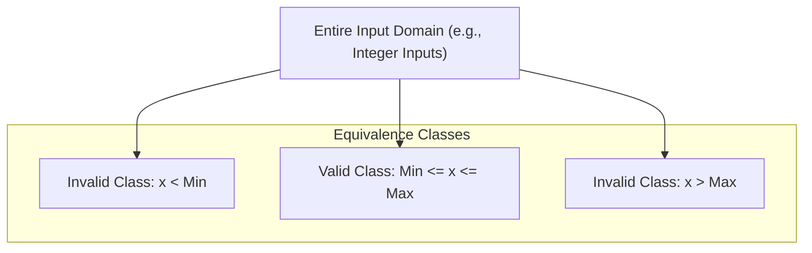
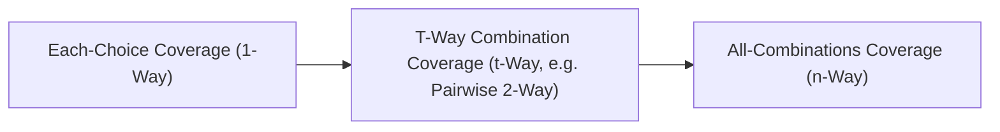

# Input Space Partitioning & Combinatorial Testing

**Input Space Partitioning (ISP)** and **Combinatorial Testing** are black-box test generation strategies that decompose the infinite or massive input domain of a program into manageable, representative equivalence classes and test combinations.

---

## 1. Equivalence Partitioning & Boundary Value Analysis

### Equivalence Partitioning
- **Principle**: Partition the input domain into disjoint subsets (equivalence classes) such that testing any single representative value from a class is assumed to uncover the same faults as testing any other value in that class.
- **Criteria**:
  - **Completeness**: Partitions must cover the entire input domain.
  - **Disjointness**: Partitions must not overlap.

### Boundary Value Analysis (BVA)
- **Principle**: Software faults disproportionately concentrate at the boundaries between partitions rather than the center.
- **Selection**: For a boundary between valid range $[a, b]$, select:
  - Just below the boundary: $a - 1$
  - On the lower boundary: $a$
  - Just above the lower boundary: $a + 1$
  - Just below the upper boundary: $b - 1$
  - On the upper boundary: $b$
  - Just above the boundary: $b + 1$

---

## 2. Combinatorial & T-Way Interaction Testing

In multi-parameter systems, bugs are rarely triggered by single isolated inputs; they are typically triggered by **interactions between parameters**.

> [!important] NIST Empirical Finding
> Studies by NIST (National Institute of Standards and Technology) across software domains show:
> - **1-way interactions**: Cause ~50% of bugs.
> - **2-way interactions (pairwise)**: Cause ~70% to 90% of bugs.
> - **3-way interactions**: Cause ~95% of bugs.
> - Bugs rarely involve interactions among more than 4 to 6 parameters ($t \le 6$).

---

## 3. Combination Strategies: From 1-Way to N-Way

| Strategy | Interaction Level | Coverage | Test Suite Size | Practicality |
| :--- | :--- | :--- | :--- | :--- |
| **Each-Choice** | $t = 1$ | Every choice of every parameter tested at least once | Minimal ($\max(|P_i|)$) | Low coverage; misses interactions |
| **Pairwise (2-Way)** | $t = 2$ | Every pair of parameter values tested together at least once | Small ($O(k^2 \log n)$) | **Industry sweet spot** (detects ~90% of bugs) |
| **$T$-Way** | $t$ arbitrary ($2 \le t < n$) | Every $t$-combination of parameter values tested | Moderate ($O(k^t)$) | Balanced trade-off for critical systems |
| **All-Combinations** | $t = n$ (exhaustive) | All possible combinations of all parameters | Exponential ($\prod |P_i|$) | Infeasible in practice; overkill |

---

## 4. Formal Definition of $T$-Way Coverage

For a system with $n$ parameters $P_1, P_2, \dots, P_n$:
- Let parameter $P_i$ have a set of discrete values (blocks) $V_i$.
- **$T$-Way Coverage Criterion**: Requires that for every subset of $t$ parameters $\{P_{i_1}, P_{i_2}, \dots, P_{i_t}\} \subseteq \{P_1, \dots, P_n\}$, every Cartesian product combination in $V_{i_1} \times V_{i_2} \times \dots \times V_{i_t}$ must appear in at least one test case in test suite $T$.

> [!example] Parameter Interaction Example
> Imagine testing an autonomous driving perception module with:
> - **Lighting**: `[Day, Night, Dawn/Dusk]` (3)
> - **Weather**: `[Clear, Rain, Snow, Fog]` (4)
> - **Obstacle**: `[Pedestrian, Vehicle, Cyclist, None]` (4)
> - **Speed Range**: `[Low, Medium, High]` (3)
> 
> - **All-Combinations ($n$-Way)**: $3 \times 4 \times 4 \times 3 = 144$ test scenarios.
> - **Pairwise ($t = 2$)**: Can cover all pairwise interactions in only **16 to 18** test cases!

---

## Related Notes
- [[Testing Strategies & Test Harnesses]] — Black-box testing principles
- [[Modified Condition Decision Coverage (MCDC)]] — White-box counterpart to combinatorial reduction
- [[Fuzzing]] — Automated boundary and grammar-based perturbation

---

## Lecture Sources & History
- **Lecture 2** (`Lecture 2 - Basic Testing Concepts.pdf`) — Equivalence partitioning and boundary value analysis.
- **Lecture 8** (`Lecture 8.pdf`) — T-way combination partitioning, parameter interaction rationale, empirical bug distributions, and 1-way vs n-way trade-offs.
