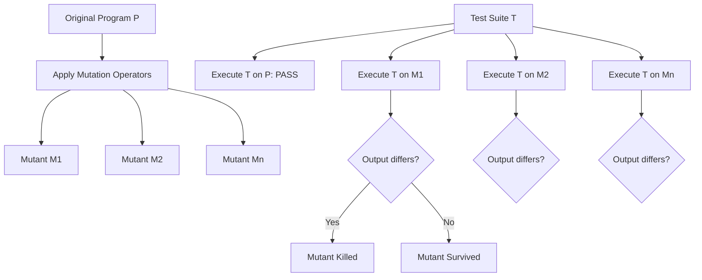

# Mutation Testing

**Mutation Testing** is a fault-based software testing technique that evaluates the effectiveness (adequacy) of a test suite by injecting artificial bugs (**mutants**) into the system and checking whether the test suite detects them.

> [!quote] Core Philosophy
> *"If a test suite is capable of catching artificial, systematically generated bugs, it is statistically likely to catch real, natural bugs."*

---

## 1. The Mutation Testing Workflow



### Steps in Mutation Testing:
1. **Mutant Generation**: Apply syntactical mutation operators (**mutators**) to the program $P$ to produce mutated program variants ($M_1, M_2, \dots, M_k$). Each mutant usually contains a single small alteration (First-Order Mutation).
2. **Test Execution**: Execute the test suite $T$ against the original program $P$ (which must pass) and against each mutant $M_i$.
3. **Outcome Comparison**:
   - **Killed Mutant**: A test case in $T$ fails on $M_i$ (produces a different output or exception compared to $P$).
   - **Survived Mutant**: All tests in $T$ pass on $M_i$ (the test suite failed to detect the injected bug).

---

## 2. Mutation Operators (Mutators)

Mutation operators define grammar-level code transformations:

| Operator Category | Description | Example Transformation |
| :--- | :--- | :--- |
| **AOR** (Arithmetic Operator Replacement) | Replaces arithmetic operators | `a + b` $\implies$ `a - b`, `a * b` |
| **ROR** (Relational Operator Replacement) | Modifies comparison operators | `if (x < y)` $\implies$ `if (x <= y)`, `if (x == y)` |
| **COR** (Conditional Operator Replacement)| Changes logical connectors | `if (a && b)` $\implies$ `if (a \|\| b)` |
| **LCR** (Logical Connector Replacement)   | Inverts or substitutes boolean values | `true` $\implies$ `false` |
| **UOI** (Unary Operator Insertion)        | Inserts unary operations | `x` $\implies$ `-x`, `++x` |
| **SDL** (Statement Deletion)              | Deletes a line or statement | `doWork();` $\implies$ `/* deleted */` |

---

## 3. Equivalent Mutants

> [!definition] Equivalent Mutant
> An **equivalent mutant** is a mutated program $M_e$ that is syntactically different from $P$ but **semantically identical** in behavior across all possible inputs.
> 
> $$ \forall x, \quad P(x) = M_e(x) $$

### Example of an Equivalent Mutant:
```c
// Original Program P
for (int i = 0; i < 10; i++) {
    if (i == 9) break;
    printf("%d\n", i);
}

// Mutated Program M (Loop condition mutated to i != 10)
for (int i = 0; i != 10; i++) {
    if (i == 9) break;
    printf("%d\n", i);
}
```
Because the loop breaks at `i == 9` in both programs, the change from `< 10` to `!= 10` can **never produce an observable difference** for any input.

> [!warning] The Equivalent Mutant Problem
> Deciding whether an arbitrary mutant is equivalent is **undecidable** in general (reduces to the Halting Problem). Equivalent mutants must either be identified through heuristics or manual inspection.

---

## 4. Mutation Score Formula

The **Mutation Score** ($MS$) measures the quality and fault-detection capability of a test suite:

$$ \text{Mutation Score} = \frac{\text{Killed Mutants}}{\text{Total Mutants} - \text{Equivalent Mutants}} \times 100\% $$

- A mutation score of **100%** indicates a **mutation-adequate** test suite.
- If equivalent mutants cannot be easily identified, the raw mutation score is:
  $$ \text{Raw MS} = \frac{\text{Killed Mutants}}{\text{Total Mutants}} \times 100\% $$

---

## 5. Strong vs. Weak Mutation

- **Strong Mutation**: A mutant is considered killed only if the mutant's internal infected state **propagates to the final output** of the program and causes an observable assertion failure.
- **Weak Mutation**: A mutant is considered killed as soon as the execution reaches the mutated statement and causes an immediate **internal state deviation** (does not require propagation to final output). Weak mutation is faster to evaluate but less rigorous.

---

## Related Notes
- [[Code Coverage Criteria]] — How structural coverage relates to mutant killing
- [[Search-Based Testing & Genetic Algorithms]] — Using mutation testing to generate automated test oracles in EvoSuite
- [[Metamorphic Testing]] — Testing programs without manual assertions

---

## Lecture Sources & History
- **Lecture 5** (`Lecture 5.pdf`) — Mutation testing principles, mutators, mutants, mutation execution steps, mutation score calculation, and equivalent mutants.
