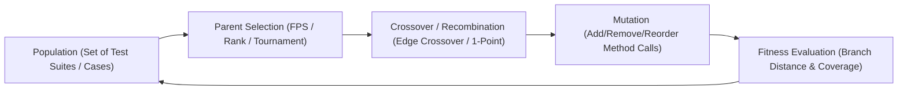
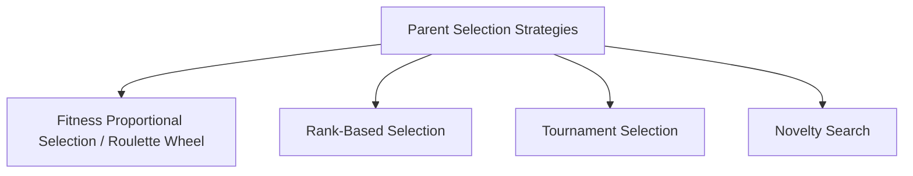
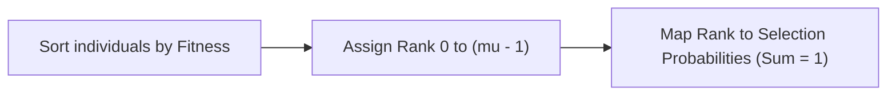

# Search-Based Testing & Genetic Algorithms

**Search-Based Software Testing (SBST)** formulates automated test case and test suite generation as an optimization problem, utilizing metaheuristic search techniques—principally **Genetic Algorithms (GAs)**—to explore the vast space of possible test sequences and maximize code coverage.

---

## 1. Genetic Algorithm Concepts in Testing

When applying Genetic Algorithms to software testing:

- **Individual / Chromosome**: A test case (sequence of method calls and arguments) or an entire test suite $T$.
- **Population**: A collection of candidate test suites.
- **Fitness Function $F(T)$**: A mathematical score evaluating how close a test suite is to achieving full coverage.
- **Crossover**: Exchanging method sequences or test cases between two parent suites.
- **Mutation**: Randomly inserting, deleting, or modifying statements, method parameters, or method calls.

---

## 2. EvoSuite: Whole Test Suite Generation

Traditional SBST targeted one branch at a time (which struggled with infeasible branches and wasted effort). **EvoSuite** (Fraser & Arcuri) introduced **Whole Test Suite Generation**, optimizing entire test suites simultaneously against all coverage goals.

### Fitness Function in EvoSuite

The fitness function $F(T)$ for a test suite $T$ across a target class with method set $M$ and branch set $B$ is defined as:

$$ F(T) = (|M| - |M_T|) + \sum_{b \in B} d(b, T) $$

Where:
- $|M|$: Total number of methods in the target class.
- $|M_T|$: Number of methods directly called/covered by test suite $T$.
- $d(b, T)$: Normalized branch distance for branch $b$.

### Branch Distance & Normalization

The branch distance $d(b, T)$ measures how close a non-executed branch was to evaluating to true:

$$ d(b, T) = \begin{cases} 
0 & \text{if branch } b \text{ is covered} \\
\nu(d_{raw}(b, T)) & \text{if predicate controlling } b \text{ was executed} \\
1 & \text{if predicate controlling } b \text{ was never executed}
\end{cases} $$

#### Normalization Function $\nu(d)$
To ensure branch distances lie strictly within $[0, 1]$ so no single branch dominates the fitness score:

$$ \nu(d) = \frac{d}{d + 1} $$

#### Raw Branch Distance Table $d_{raw}(b, T)$
Depending on the relational predicate in the code:

| Predicate | Distance Computation $d_{raw}$ |
| :--- | :--- |
| `x == y` | $|x - y|$ |
| `x != y` | $0$ (if $x \ne y$) else $1$ |
| `x < y` | $\begin{cases} 0 & \text{if } x < y \\ x - y + \epsilon & \text{if } x \ge y \end{cases}$ |
| `x <= y` | $\begin{cases} 0 & \text{if } x \le y \\ x - y & \text{if } x > y \end{cases}$ |
| `x > y` | $\begin{cases} 0 & \text{if } x > y \\ y - x + \epsilon & \text{if } x \le y \end{cases}$ |
| `Boolean A` | $0$ (if $A$ is True) else $K$ |

---

## 3. Edge Crossover & Edge Tables

**Edge Crossover** is a specialized permutation recombination operator designed for ordering problems (e.g., sequences of method calls) that preserves adjacencies (edges) from both parents.

### Step-by-Step Walkthrough

> [!example] Edge Crossover Example
> Consider two parent permutations:
> - **$P_1 = (8, 4, 1, 3, 7, 2, 9, 5, 6)$**
> - **$P_2 = (3, 7, 4, 8, 1, 5, 6, 2, 9)$**
> 
> *Tie-breaking rule*: Select the lowest numeric element.

#### Step 1: Construct the Edge Table
For each element, list all adjacent neighbors from both parents (treating the sequences as circular/wrapping).

| Element | Neighbors in $P_1$ | Neighbors in $P_2$ | Combined Neighbor List |
| :---: | :---: | :---: | :--- |
| **1** | $4, 3$ | $8, 5$ | $\{3, 4, 5, 8\}$ |
| **2** | $7, 9$ | $6, 9$ | $\{6, 7, 9^+\}$ (9 is shared) |
| **3** | $1, 7$ | $9, 7$ | $\{1, 7^+, 9\}$ (7 is shared) |
| **4** | $8, 1$ | $7, 8$ | $\{1, 7, 8^+\}$ (8 is shared) |
| **5** | $9, 6$ | $1, 6$ | $\{1, 6^+, 9\}$ (6 is shared) |
| **6** | $5, 8$ | $5, 2$ | $\{2, 5^+, 8\}$ (5 is shared) |
| **7** | $3, 2$ | $3, 4$ | $\{2, 3^+, 4\}$ (3 is shared) |
| **8** | $6, 4$ | $4, 1$ | $\{1, 4^+, 6\}$ (4 is shared) |
| **9** | $2, 5$ | $2, 3$ | $\{2^+, 3, 5\}$ (2 is shared) |

#### Step 2: Offspring Construction Algorithm
1. Start at the initial element (e.g., first parent's first element or lowest element).
2. Remove current element from all neighbor lists.
3. If current element has neighbors with shared edges ($+$), pick the shared edge.
4. Otherwise, pick the neighbor with the **fewest remaining edges** in its list.
5. In case of ties in edge count, apply the tie-breaker (lowest numeric element).
6. If a neighbor list is empty, pick an unvisited element at random (or lowest).

---

## 4. Parent Selection Mechanisms

Selection operators choose candidate individuals from the current generation to breed the next generation.

### 4.1. Fitness Proportional Selection (FPS / Roulette Wheel)
Each individual $i$ is assigned a selection probability proportional to its fitness $f_i$:

$$ P(i) = \frac{f_i}{\sum_{j=1}^{\mu} f_j} $$

#### Limitations of Raw FPS:
1. **Premature Convergence**: Early "super-individuals" dominate the population rapidly, trapping search in local optima.
2. **Uneven Selective Pressure**: Strong selective pressure early on, but almost zero selective pressure late in the search when all individuals have similar high fitness.
3. **Lack of Transposition Invariance**:
   - Fitness scores $\{1, 2, 3\} \implies P = \{\frac{1}{6}, \frac{2}{6}, \frac{3}{6}\} = \{16.7\%, 33.3\%, 50\%\}$ (High pressure).
   - Transposed scores $\{1001, 1002, 1003\} \implies P \approx \{33.3\%, 33.3\%, 33.3\%\}$ (Zero pressure, despite identical score differences!).

---

### 4.2. Correcting FPS Scale Issues

#### Windowing (Linear Dynamic Scaling)
Subtracts the worst individual's fitness ($f_{worst}$) from all individuals to normalize scale:

$$ f'_i = f_i - f_{worst} $$

#### Goldberg's Sigma ($\sigma$) Scaling
Uses the population mean ($\bar{f}$) and standard deviation ($\sigma$) to keep selective pressure constant across generations:

$$ f'_i = \max(0, \, f_i - (\bar{f} - c \cdot \sigma)) $$
*(typically $c \in [1, 3]$)*.

---

### 4.3. Rank-Based Selection

Rank-based selection eliminates absolute fitness values entirely and bases selection probabilities solely on the **sorted rank order** of individuals:

1. Sort $\mu$ individuals from worst (Rank $0$) to best (Rank $\mu - 1$).
2. Assign selection probability $P_{sel}(i)$ based on rank.
3. **Benefits**: Transposition invariant, resistant to extreme outliers, and maintains uniform selective pressure across all generations.

---

## 5. Simple Genetic Algorithm (SGA) Archetype

| Component | SGA Specification |
| :--- | :--- |
| **Representation** | Bit-strings $\{0, 1\}^L$ |
| **Recombination** | 1-Point Crossover |
| **Mutation** | Bit-Flip Mutation (probability $p_m \approx 1/L$) |
| **Parent Selection** | Fitness Proportional Selection (FPS) |
| **Survival Selection** | Generational Replacement |

---

## Related Notes
- [[Control Flow Graphs (CFG)]] — Calculating branch distances across CFG edges
- [[Mutation Testing]] — EvoSuite uses mutation testing to synthesize automated assertion oracles
- [[Fuzzing]] — Alternative automated input generation mechanism

---

## Lecture Sources & History
- **Lecture 9** (`Lecture 9.pdf`) — Genetic algorithms in testing, EvoSuite architecture, fitness formula $F(T)$, and branch distance calculation.
- **Lecture 11** (`Lecture 11.pdf`) — Edge crossover algorithm, edge table construction, FPS limitations, Windowing, $\sigma$-scaling, and Rank-based selection.
