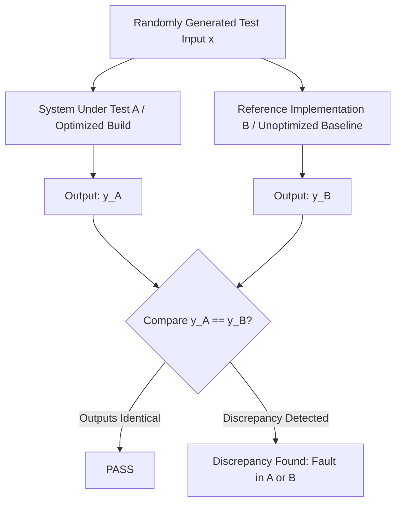

# Differential Testing

**Differential Testing** is a testing technique that addresses the test oracle problem by executing **multiple distinct implementations of the same specification** (or comparing the system against an earlier version / different optimization level) with identical inputs and observing differences in their output.

---

## 1. Differential Testing Architecture

### Key Principles:
- Requires **zero manually crafted assertions** or precomputed truth values for specific inputs.
- The reference implementation acts as a **pseudo-oracle**.
- When outputs diverge ($y_A \ne y_B$), at least one of the implementations contains a defect.

---

## 2. Common Applications

### 2.1. Compiler Optimization Verification
- **Scenario**: Validate that an advanced compiler optimization (e.g., `-O3` in GCC/Clang) does not alter program semantics compared to unoptimized compilation (`-O0`).
- **Workflow**:
  1. Generate random valid C programs (e.g., via Csmith).
  2. Compile with `gcc -O0` $\implies \text{Binary } B_0$.
  3. Compile with `gcc -O3` $\implies \text{Binary } B_3$.
  4. Run both binaries on identical input. If $B_0(x) \ne B_3(x)$, the compiler optimization introduced a miscompilation bug!

### 2.2. Multi-Engine & Browser Testing
- Comparing JavaScript engines (V8 in Chrome vs. SpiderMonkey in Firefox vs. JavaScriptCore in Safari).
- Comparing SQL database engines (PostgreSQL vs. MySQL vs. SQLite on standard SQL queries).

### 2.3. Deep Learning Frameworks
- Running identical model architectures with identical weights on PyTorch vs. TensorFlow vs. ONNX Runtime to identify numerical precision drifts and kernel operator bugs.

---

## 3. Comparison: Metamorphic vs. Differential Testing

| Dimension | [[Metamorphic Testing]] | Differential Testing |
| :--- | :--- | :--- |
| **Number of Systems** | 1 (Single System Under Test) | $\ge 2$ (Multiple implementations / builds) |
| **Number of Inputs** | $\ge 2$ (Source input $x$ and transformed $x'$) | 1 (Same input $x$ executed across all systems) |
| **Oracle Basis** | Domain relation / property $R(x, x', y, y')$ | Output parity ($y_A = y_B$) |
| **Prerequisites** | Valid domain transformation function $g(x)$ | Alternative working implementation or compiler flags |

---

## Related Notes
- [[Testing Strategies & Test Harnesses]] — Overcoming the Oracle Problem
- [[Metamorphic Testing]] — Property-based testing on a single system
- [[Machine Learning Foundations for QA]] — Quality evaluation across model versions

---

## Lecture Sources & History
- **Lecture 12** (`Lecture 12.pdf`) — Differential testing definition, before/after compiler optimization comparisons.
