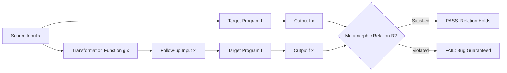

# Metamorphic Testing

**Metamorphic Testing (MT)** is an automated software testing methodology designed specifically to alleviate **The Oracle Problem**—the situation where the expected output for an arbitrary test input cannot be easily determined, is unknown, or is computationally prohibitive to verify manually.

Instead of asserting the absolute correctness of a single output $f(x) = y$, Metamorphic Testing checks whether **necessary relationships between multiple inputs and their corresponding outputs** hold true.

---

## 1. The Metamorphic Testing Framework

### Core Components:
1. **Source Input ($x$)**: An initial test input generated randomly, manually, or via search/fuzzing.
2. **Transformation Function ($g$)**: A domain-specific mapping that perturbs source input $x$ into a **follow-up input** $x' = g(x)$.
3. **Metamorphic Relation ($R$)**: A fundamental mathematical or domain invariant specifying how the output should change (or remain unchanged) given the transformation:
   $$ R(x, x', f(x), f(x')) $$
4. **Failure Detection**: If relation $R$ evaluates to **False** for any $(x, x')$, then a bug in program $f$ is **guaranteed**:
   $$ \neg R(x, x', f(x), f(x')) \implies \text{Fault in } f $$

---

## 2. Concrete Examples of Metamorphic Relations

### Example 1: Mathematical / Trigonometric Function ($f(x) = \sin(x)$)
- **Source input**: $x$
- **Transformation function**: $x' = \pi - x$
- **Metamorphic Relation**:
  $$ f(x) = f(x') \iff \sin(x) = \sin(\pi - x) $$
- **Testing**: Generate random floats $x \in \mathbb{R}$. Even if we don't know $\sin(1.392817)$ offhand, if `abs(sin(x) - sin(pi - x)) > eps`, we know the implementation is buggy.

---

### Example 2: Shortest Path Algorithm (Dijkstra / Graph Search)
- **Target Program**: `shortest_path(G, A, B)` $\to$ distance $d$.
- **Transformation $g(G)$**: Multiply all edge weights in $G$ by constant $k > 0$ to produce $G'$.
- **Metamorphic Relation**:
  $$ \text{shortest\_path}(G', A, B) = k \cdot \text{shortest\_path}(G, A, B) $$

---

### Example 3: Search Engine / Information Retrieval
- **Target Program**: `search("machine learning")` $\to$ Result list $L_1$.
- **Transformation**: `search("machine learning AND machine learning")` $\to$ Result list $L_2$.
- **Metamorphic Relation**:
  $$ L_1 = L_2 $$

---

### Example 4: Deep Learning & Biometric Authentication
- **Target Program**: `auth(image)` $\to \{\text{True}, \text{False}\}$ (unlocks biometric lock for authenticated user).
- **Transformation**: Add a semi-transparent facemask or adjust ambient lighting on the image ($x \to x'$).
- **Metamorphic Relation (Robustness Invariant)**:
  $$ \text{auth}(x) \iff \text{auth}(x') $$
- If a legitimate user is authenticated without a mask, adding an expected perturbation should not cause an authentication denial.

---

## 3. Metamorphic Testing in AI & Machine Learning

Metamorphic testing is one of the most effective paradigms for testing **Deep Learning and Non-Deterministic Systems** where traditional unit tests fail:

| ML Application | Transformation $g(x)$ | Expected Metamorphic Invariant |
| :--- | :--- | :--- |
| **Object Detection** | Add synthetic rain / fog to driving frame | Detected cars/pedestrians should not vanish |
| **Sentiment Analysis** | Substitute synonyms (*"great"* $\to$ *"fantastic"*) | Sentiment prediction class must remain unchanged |
| **Machine Translation** | Translate English $\to$ French $\to$ English | Core semantic content must be preserved |
| **Matrix Operations** | Transpose input $A^T$ | Determinant $\det(A) = \det(A^T)$ |

---

## Related Notes
- [[Testing Strategies & Test Harnesses]] — The Oracle Problem defined
- [[Differential Testing]] — Comparing outputs against alternate reference implementations
- [[Machine Learning Foundations for QA]] — Quality assurance for data-driven systems

---

## Lecture Sources & History
- **Lecture 9** (`Lecture 9.pdf`) — Introduction to the oracle problem, source inputs, transformation functions, and metamorphic relations.
- **Lecture 12** (`Lecture 12.pdf`) — Formal metamorphic relation definitions, sin(pi - x) example, and biometric facial recognition verification.
