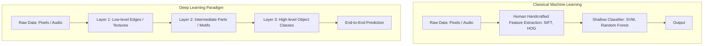
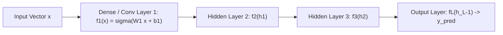
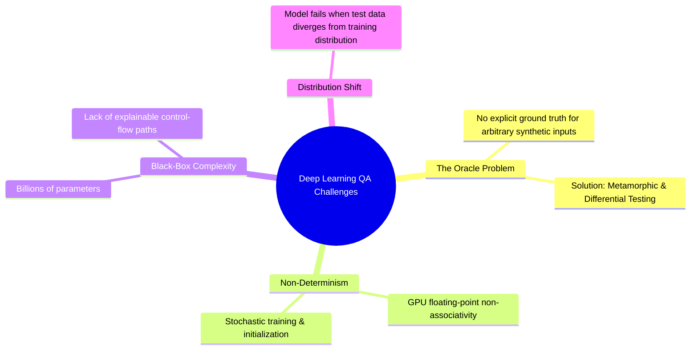

# Deep Learning Architecture & Testing

**Deep Learning (DL)** replaces manual, handcrafted feature engineering with hierarchical **representation learning**, composing layers of non-linear transformations to automatically discover abstractions from raw data.

---

## 1. Classical Machine Learning vs. Deep Learning

### Representation Learning
- **Classical ML**: Depends heavily on domain experts to craft features. The quality of testing often focuses on feature extractor heuristics.
- **Deep Learning**: Learns intermediate representations end-to-end directly from raw sensory inputs.

---

## 2. Layer Composition & Neural Network Architecture

A deep neural network is mathematically modeled as a composite function $F(x)$:

$$ F(x) = (f_L \circ f_{L-1} \circ \dots \circ f_2 \circ f_1)(x) $$

### Key Mathematical Components:
1. **Linear Transformation (Dense / Fully Connected Layer)**:
   $$ z = W x + b $$
   *(where $W$ is the weight matrix and $b$ is the bias vector)*.
2. **Non-Linear Activation Function ($\sigma$)**:
   $$ a = \sigma(z) $$
   *(e.g., ReLU, GeLU, Sigmoid, Softmax)*. Non-linearities allow the network to approximate arbitrary non-linear decision boundaries (Universal Approximation Theorem).
3. **Depth**: Composing many layers ($L \gg 1$) allows networks to build hierarchical concepts, where earlier layers capture local primitives and deeper layers capture abstract global semantics.

---

## 3. Unique Quality Assurance & Testing Challenges for Deep Learning

Testing Deep Neural Networks differs fundamentally from testing traditional software due to the following characteristics:

### Summary of Testing Strategies for DL:
1. **Adversarial Robustness Testing**: Evaluating whether imperceptible input perturbations ($\delta$) cause catastrophic classification flips (e.g., FGSM, PGD attacks).
2. **Metamorphic Invariance Testing**: Applying transformations like rotations, translations, lighting changes, or blur (see [[Metamorphic Testing]]).
3. **Neuron & Layer Coverage**: Extending traditional structural code coverage ([[Code Coverage Criteria]]) to neuron activation metrics (e.g., DeepXplore neuron coverage).
4. **Differential Execution**: Validating cross-framework numerical stability between PyTorch, ONNX, and TensorRT (see [[Differential Testing]]).

---

## Related Notes
- [[Machine Learning Foundations for QA]] — Loss functions, generalization, overfitting, and bias/variance
- [[Metamorphic Testing]] — Core technique for testing deep learning systems
- [[Differential Testing]] — Cross-hardware and cross-engine testing for neural networks

---

## Lecture Sources & History
- **Lecture 15** (`Lecture 15.pdf`) — Representation learning vs handcrafted features, layer composition, dense connections, and deep neural architectures.
