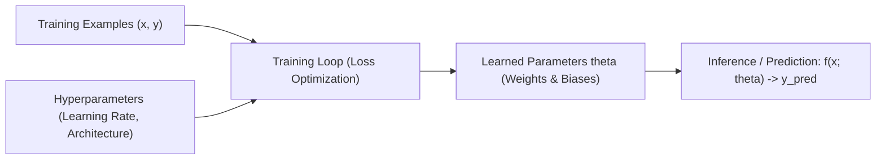
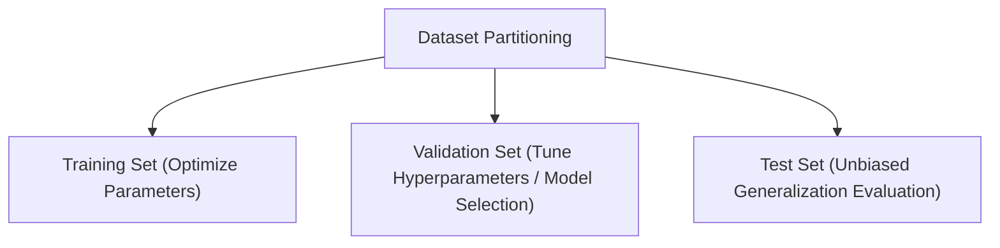
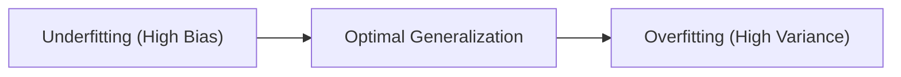
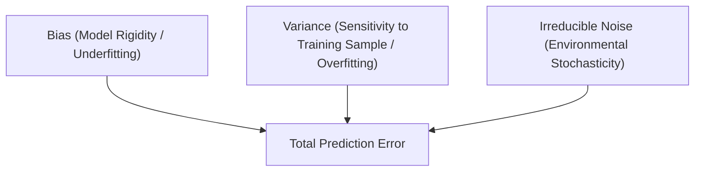

# Machine Learning Foundations for QA

Traditional software quality assurance tests explicitly coded control logic ($P(x) \to y$). In **Machine Learning (ML)**, logic is not explicitly programmed; instead, an algorithm learns a mapping function $f(x) \to y$ from data.

Testing ML systems therefore requires testing **data, model parameters, generalization capacity, and inductive biases**.

---

## 1. Supervised Learning Formalism

The goal of supervised learning is to learn a parameter-dependent function $f(x; \theta)$ mapping input features $x$ to target outputs $y$:

$$ y = f(x; \theta) $$

### Problem Classes:
- **Regression**: Target variable $y$ is continuous / quantitative (e.g., predicting temperature, price, steering angle). Evaluated via residuals:
  $$ \text{Residual} = y_{\text{actual}} - y_{\text{predicted}} $$
  - $\text{Residual} > 0 \implies \text{Underpredicted}$
  - $\text{Residual} < 0 \implies \text{Overpredicted}$
- **Classification**: Target variable $y$ is discrete / categorical (e.g., pedestrian vs. cyclist, pass vs. fail).

---

## 2. Generalization & The Learning Curves

> [!definition] Generalization
> **Generalization** is the ability of a trained model to make accurate predictions on **unseen data points** drawn from the same joint distribution.

> [!warning] Pitfall: Training Loss Is Not a Test Oracle
> Achieving a training loss near zero is necessary but **not sufficient**. A model can easily memorize random noise in the training set and fail completely on novel inputs.

---

## 3. Underfitting, Overfitting, and Model Fitness

| State | Definition | Manifestation in QA / Testing | Remediation |
| :--- | :--- | :--- | :--- |
| **Underfitting** | Model is too simple to capture underlying patterns | High training error & high validation error | Increase model capacity, add features, reduce regularization |
| **Good Fit** | Model captures underlying trend and generalizes well | Low training error & low validation error | Preserve architecture, validate on adversarial splits |
| **Overfitting** | Model memorizes training noise and idiosyncrasies | Low training error, but **high validation/test error** | Regularization ($L_1/L_2$), dropout, data augmentation, cross-validation |

---

## 4. The Bias-Variance Tradeoff

Total expected prediction error on unseen data decomposes into three terms:

$$ \text{Expected Error} = \text{Bias}^2 + \text{Variance} + \text{Irreducible Noise} $$

- **Bias**: Error introduced by approximating a complex real-world problem with a simplified model class.
- **Variance**: Amount by which the learned function $f(x)$ would change if trained on a different dataset drawn from the same population. High variance models are hyper-sensitive to training fluctuations.

---

## 5. Model Selection & Quality Evaluation Techniques

1. **Cross-Validation ($K$-Fold)**: Partition data into $K$ folds; train on $K-1$ and evaluate on the remaining fold, repeating $K$ times to assess variance.
2. **Regularization**: Penalizing large parameter magnitudes in the loss function to constrain model complexity:
   $$ \mathcal{L}_{\text{total}}(\theta) = \mathcal{L}_{\text{task}}(\theta) + \lambda \cdot \Omega(\theta) $$
3. **Residual Analysis**: Plotting distribution of residuals to ensure errors are normally distributed with zero mean and no systematic bias patterns across feature dimensions.

---

## Related Notes
- [[Deep Learning Architecture & Testing]] — Deep neural network representations and QA challenges
- [[Metamorphic Testing]] — Testing ML systems without explicit labels
- [[Differential Testing]] — Comparing ML framework runtimes

---

## Lecture Sources & History
- **Lecture 14** (`Lecture 14.pdf`) — Supervised ML, regression vs classification, generalization, overfitting, underfitting, bias-variance tradeoff, and residuals.
