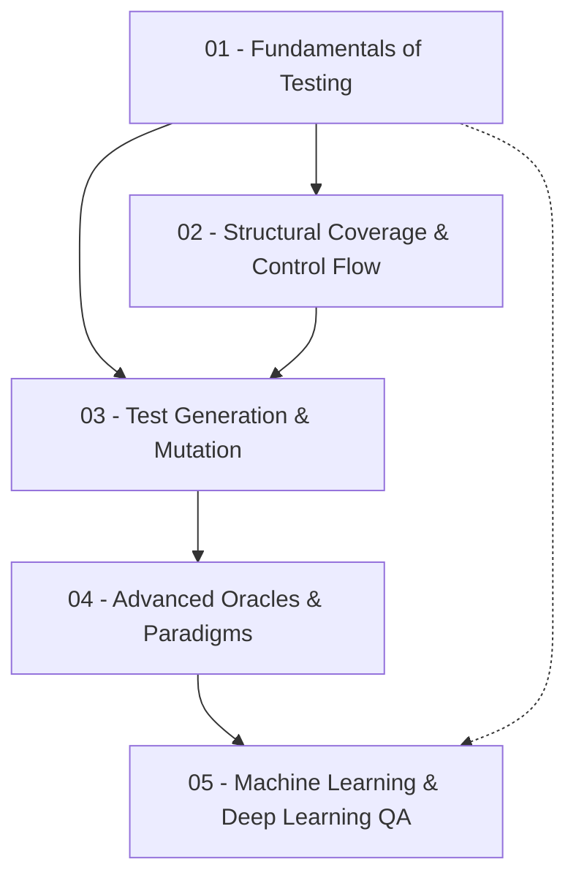

# COMP6970: QA for Deep Learning — Map of Content

Welcome to the **Obsidian Knowledge Store** for **COMP6970 - Quality Assurance for Deep Learning**.

This knowledge store organizes the course curriculum into 5 cohesive topic modules, replacing chronological lecture slides with an interconnected, concept-oriented graph.

---

## 🗺️ Knowledge Map & Conceptual Hierarchy

---

## 📚 Topic Modules & Notes

### Module 01: Fundamentals of Software Testing
*The essential vocabulary, economics, and architectural building blocks of software verification.*
- [[Software Testing Foundations]]: Definitions of errors, faults/defects, and failures; Verification vs. Validation; Dijkstra's principle; Testing economics and the exponential cost of bugs.
- [[Testing Strategies & Test Harnesses]]: Black-box, white-box, and grey-box visibility; Test cases, test suites, and test fixtures; The Test Oracle and the Oracle Problem.
- [[Unit Testing & xUnit Frameworks]]: The xUnit genealogy (SUnit, JUnit, PyUnit, NUnit); Test runner architecture; The Arrange-Act-Assert (AAA) pattern.

---

### Module 02: Structural Coverage & Control Flow
*Graph-theoretic modeling of software logic and formal coverage adequacy criteria.*
- [[Control Flow Graphs (CFG)]]: Graph elements, basic blocks, leader statement identification algorithms, and the Euclid's GCD walkthrough.
- [[Code Coverage Criteria]]: Statement, branch, and path coverage metrics; The path explosion problem; Mathematical proof of branch coverage subsuming statement coverage.
- [[Modified Condition Decision Coverage (MCDC)]]: Boolean condition independence, test pair selection, adequacy scoring, and the linear $N + 1$ test suite rule for safety-critical systems.

---

### Module 03: Test Generation & Mutation Testing
*Techniques for systematically generating inputs, evaluating test quality, and metaheuristic optimization.*
- [[Input Space Partitioning & Combinatorial Testing]]: Equivalence classes, boundary value analysis (BVA), and $T$-way / pairwise parameter interaction testing.
- [[Mutation Testing]]: Injecting artificial bugs, mutation operators (AOR, ROR, COR, LCR), mutation score formula, strong vs. weak mutation, and equivalent mutants.
- [[Search-Based Testing & Genetic Algorithms]]: Automated test generation with EvoSuite; Whole test suite fitness function $F(T)$; Branch distance computation $d(b, T)$ and normalization $\nu(d)$; Edge Crossover algorithm and edge tables; Parent selection (FPS, Windowing, $\sigma$-Scaling, Rank-based selection).
- [[Fuzzing]]: Robustness testing for crashes and security vulnerabilities; Black-box mutation/grammar fuzzing vs. AFL coverage-guided grey-box fuzzing.

---

### Module 04: Advanced Oracles & Testing Paradigms
*Addressing the Oracle Problem in non-deterministic and complex computational domains.*
- [[Metamorphic Testing]]: Source inputs, transformation functions $g(x)$, and metamorphic relations $R$; Mathematical, shortest path, and biometric AI examples.
- [[Differential Testing]]: Cross-implementation and compiler optimization verification without precomputed ground truth.

---

### Module 05: Machine Learning & Deep Learning QA
*Quality assurance, generalization, and testing methodologies for data-driven representations.*
- [[Machine Learning Foundations for QA]]: Supervised learning formalism, regression residuals, generalization, overfitting vs. underfitting, bias-variance tradeoff, and cross-validation.
- [[Deep Learning Architecture & Testing]]: Representation learning vs. handcrafted features, neural layer compositions, non-linear activations, and unique DL testing challenges (oracle problem, non-determinism, adversarial robustness).

---

## 🔍 Lecture-to-Topic Traceability Matrix

To trace concepts back to the original lectures:

| Date / Topic | Primary Topic Notes                                                                           |
| :----------- | :-------------------------------------------------------------------------------------------- |
| Aug 17       | [[Software Testing Foundations]]                                                              |
| Aug 19       | [[Testing Strategies & Test Harnesses]], [[Input Space Partitioning & Combinatorial Testing]] |
| Aug 21       | [[Unit Testing & xUnit Frameworks]], [[Control Flow Graphs (CFG)]]                            |
| Aug 24       | [[Code Coverage Criteria]]                                                                    |
| Aug 26       | [[Mutation Testing]]                                                                          |
| Aug 28       | [[Modified Condition Decision Coverage (MCDC)]]                                               |
| Aug 31       | [[Control Flow Graphs (CFG)]], [[Code Coverage Criteria]]                                     |
| Sep 4        | [[Input Space Partitioning & Combinatorial Testing]]                                          |
| Sep 11       | [[Search-Based Testing & Genetic Algorithms]], [[Fuzzing]], [[Metamorphic Testing]]           |
| Sep 14       | *Review / Discussion Session*                                                                 |
| Sep 14       | [[Search-Based Testing & Genetic Algorithms]]                                                 |
| Sep 14       | [[Metamorphic Testing]], [[Differential Testing]]                                             |
| Sep 18       | *Review / Discussion Session*                                                                 |
| Sep 18       | [[Machine Learning Foundations for QA]]                                                       |
| Sep 21       | [[Deep Learning Architecture & Testing]]                                                      |

---

## 🏷️ Tags Index
- `#comp6970`
- `#testing-foundations`
- `#structural-testing`
- `#white-box-testing`
- `#black-box-testing`
- `#code-coverage`
- `#mcdc`
- `#mutation-testing`
- `#search-based-testing`
- `#genetic-algorithms`
- `#fuzzing`
- `#metamorphic-testing`
- `#differential-testing`
- `#machine-learning`
- `#deep-learning-qa`
